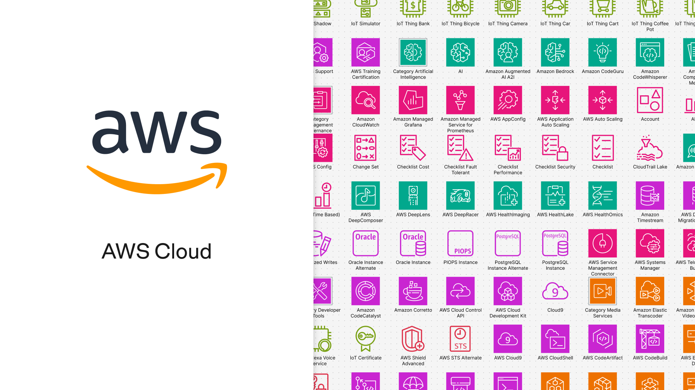
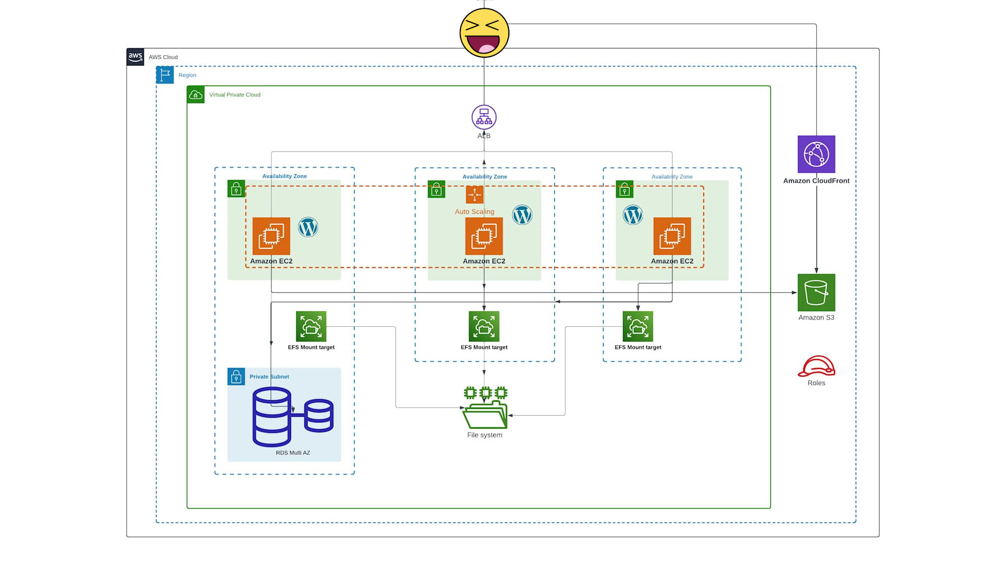

# 4 ~~Cosas~~ *Cosicas*   Sobre Tus Servicios Favoritos

::: Notes   

Based on [Zaragoza and Ebro view from the highest tower, by Gregorio Puga Bailón from A Coruña, https://commons.wikimedia.org/wiki/File:Zaragoza_and_Ebro_view_from_the_highest_tower.jpg](https://upload.wikimedia.org/wikipedia/commons/f/f9/Zaragoza_and_Ebro_view_from_the_highest_tower.jpg)

:::

### AWS Services

::: Notes

240 different services.

what the heck is AWS Service Management Connector.

:::

### The good things

## Storage

### Superb Service Storage (S3)

* 🪦 Requiem for Select 🪦
* 🦁 Wild wirecards 🦁
* ⚡ Faster ⚡
* ⛰️ Higher ⛰️
* 💪 Stronger 💪
* 🤝 Together 🤝

::: Notes

Talk about spending the afternoon watching curling games on the Olympics.

* All good free things become to and end, and Select will not be available for new accounts
* Do the wild **wirecards demo**. 
    - **S3 Inventory** generates flat files with objects and metadata.
    - **S3 Metadata** provides live inventory table updated each hour, plus journal with events. All searcheable.
* Faster: do the **parallel upload demo** and talk about multipart
* Higher: from 5TB to **50TB**. Still, rewrite it all for changing one byte
* Stronger: **strong consistency** on all regions allows things like S3 Mount
* Together: **Amazon S3 Multi-Region Access Points** (MRAPs) provide a single global endpoint to route S3 requests across replicated buckets in multiple AWS Regions

:::*

### DynamoDB + SQL

PartiQL is a SQL-compatible query language for querying and analyzing semi-structured data across AWS services like DynamoDB, S3, and Redshift.

There will be dragons🐉

::: Notes

* DynamoDB native queries are the worst, after Mongo's
* SQL is handy, do the demo
* Sawbuck is a reindeer with **flowers on its antlers**. So cool.
* BEWARE OF **JOINS AND SCANS**

:::

### RDS (Aurora)

* 🧬🧬 **Fast cloning** with copy-on-write snapshots for dev and reporting 
* ⌯⌲ **Local write forwarding** on replicas eliminates dual endpoints with 20ms latency
* 💸💱 **Aurora I/O-Optimized** for stop worrying about IOPS

::: Notes

* Fast cloning: 
    * copy-on-write
    * 5 min for starting up the instance
    * Awesome for reporting or dev. 
    * Storage payed for updated pages
* Local write forwarding:
    * Started in Aurora Global
    * Extended to local replica nodes
    * No need to keep two endpoints
    * Isolation/Lock considerations
    * 20ms latency
    * Joke about "Too much? well, if you go n+1 with hibernate..."
* Aurora I/O-Optimized
    * Increases instance+storage cost and elliminates IOPS
    * Useful when IOPS > 25% of the bill 
:::

## Compute

### Autoscaling Groups

* 🐦‍🔥 Maximum Instance Lifetime
* ✨ Capacity rebalancing
* 🌡️ Warm Pool
* ♻️ EC2 Instance Refresh

::: Notes

* Max lifetime: includes availability budgets.
* Capacity rebalancing: replaces spot in risk of being reclaimed
* Warm pool: super cool for windows.
* Instance refresh: demo!

:::

## Traffic

* OIDC-compliant authentication
* Least_outstanding_requests connections
* Health thresholds

::: Notes

* Authentication
    * Works with Entra ID, Cognito, etc
    * Signs a JWT with ALB's key 
    * Contains groups in claim
* Least oustanding
    * Will help nodes that accumlate longer requests
    * Nodes can run an agent for managing weights
* Health thresholds
    * Percentage of healthy instances
    * Integrates with R53
    * Automatic failover on R53

:::

### CloudFront

* 🔵🟢Staging distributions
* 🏗️ Continous deployment

::: Notes

* Two distributions: main and staging
* Up to 15% of the traffic to staging
* Supports sticky distributions
* A/B, Canary...

:::

### github.com/ciberado

* [linkedin.com/in/javier-more](linkedin.com/in/javier-more)
* [javi.moreno@global.ntt](mailto:javi.moreno@global.ntt)
* [javi.moreno@aprender.cloud](mailto:javi.moreno@aprender.cloud)

